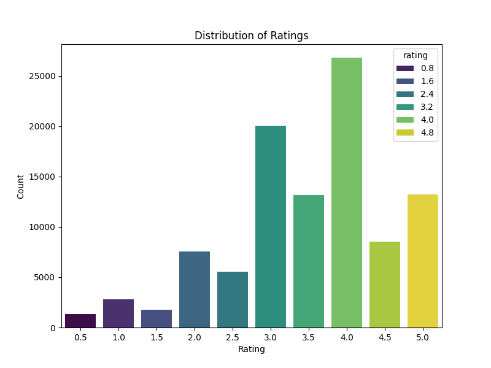

# Laporan Proyek Akhir Sistem Rekomendasi Film: MovieLens 100K

## 1. Project Overview
Proyek ini bertujuan untuk membangun sistem rekomendasi film menggunakan dataset MovieLens. Sistem rekomendasi sangat penting dalam industri hiburan modern karena membantu pengguna menemukan konten baru yang relevan, meningkatkan kepuasan pengguna, dan mendorong interaksi dengan platform. Dengan semakin banyaknya pilihan film yang tersedia, sistem rekomendasi menjadi krusial untuk mengatasi masalah kelebihan informasi dan menyajikan pengalaman yang dipersonalisasi kepada setiap pengguna.

## 2. Business Understanding
### Problem Statements
Pengguna seringkali kesulitan menemukan film yang sesuai dengan preferensi mereka di antara ribuan film yang tersedia. Hal ini dapat menyebabkan pengalaman pengguna yang kurang memuaskan dan potensi kehilangan minat terhadap platform.

### Goals
Tujuan dari proyek ini adalah untuk mengembangkan sistem rekomendasi film yang mampu menyarankan film-film yang relevan kepada pengguna berdasarkan riwayat tontonan dan preferensi mereka, sehingga meningkatkan pengalaman pengguna dan retensi.

### Solution Approach
Dalam proyek ini, kami akan mengimplementasikan dua pendekatan sistem rekomendasi yang berbeda: Collaborative Filtering dan Content-Based Filtering. 
* Collaborative Filtering akan menggunakan algoritma LightFM, yang bekerja dengan menganalisis interaksi pengguna-item untuk menemukan pola dan kesamaan. 
* Content-Based Filtering akan merekomendasikan item berdasarkan atribut item itu sendiri, seperti genre film, dengan menghitung kesamaan antar item.

## 3. Data Understanding
Dataset yang digunakan adalah MovieLens ml-latest-small, yang berisi 100.836 rating dan 3.683 aplikasi tag dari 610 pengguna untuk 9.742 film. Data ini dikumpulkan antara 29 Maret 1996 dan 24 September 2018. Dataset ini terdiri dari empat file CSV:

- `movies.csv`: Berisi `movieId`, `title`, dan `genres` film.
- `ratings.csv`: Berisi `userId`, `movieId`, `rating`, dan `timestamp` dari setiap rating yang diberikan pengguna.
- `tags.csv`: Berisi `userId`, `movieId`, `tag`, dan `timestamp` dari setiap tag yang diterapkan pengguna.
- `links.csv`: Berisi `movieId`, `imdbId`, dan `tmdbId` untuk menghubungkan film dengan database eksternal.

**Tautan Sumber Data:**  
[https://grouplens.org/datasets/movielens/latest/](https://grouplens.org/datasets/movielens/latest/)

**Informasi Data:**
- `movies.csv`: Tidak ada nilai yang hilang. Berisi 9742 entri film.
- `ratings.csv`: Tidak ada nilai yang hilang. Berisi 100836 entri rating.

**Distribusi Rating:** 
Rating diberikan pada skala 0.5 hingga 5.0. Distribusi rating menunjukkan bahwa sebagian besar rating berada di angka 3.0, 3.5, 4.0, dan 5.0, menunjukkan kecenderungan pengguna untuk memberikan rating yang cukup tinggi.

**Distribusi Genre:** 
Genre film paling populer dalam dataset adalah Drama, Comedy, dan Thriller.

## 4. Data Preparation
Tahapan persiapan data meliputi:
- **Pemetaan ID:**  
Untuk Collaborative Filtering, `userId` dan `movieId` dipetakan ke ID internal yang berurutan mulai dari 0 untuk digunakan oleh LightFM.
- **Pembuatan Matriks Interaksi:**  
Matriks interaksi `user-item` dibuat menggunakan `csr_matrix` dari `scipy.sparse`. Matriks ini merepresentasikan apakah seorang pengguna telah berinteraksi (memberi rating) pada suatu film. Meskipun rating eksplisit tersedia, kami menggunakan pendekatan implisit (interaksi biner) untuk model LightFM dengan `loss=\'warp\'`.
- **Pembagian Data:**  
Data rating dibagi menjadi set pelatihan (80%) dan set pengujian (20%) untuk evaluasi model yang tepat.
- **Pra-pemrosesan Genre:** 
  Sebelum melakukan ekstraksi fitur konten, kolom `genres` yang semula berbentuk list diubah terlebih dahulu menjadi string yang dipisahkan oleh tanda "|" agar dapat diproses oleh TF-IDF.
- **Ekstraksi Fitur Konten:**  
Untuk Content-Based Filtering, genre film diubah menjadi representasi numerik menggunakan TF-IDF Vectorizer. Kemudian, kesamaan kosinus dihitung antar film berdasarkan vektor genre mereka.

## 5. Modeling and Result
### Collaborative Filtering (LightFM)
Menggunakan model LightFM dengan fungsi kerugian `WARP` (Weighted Approximate-Rank Pairwise). Model ini dilatih pada matriks interaksi pelatihan selama 30 epoch.

**Evaluasi Model LightFM:**
- **Train Precision@k:** 0.4628
- **Test Precision@k:** 0.0952
- **Train Recall@k:** 0.0718
- **Test Recall@k:** 0.0628

Hasil evaluasi menunjukkan bahwa model LightFM memiliki presisi yang lebih tinggi pada data pelatihan dibandingkan data pengujian, yang wajar. Recall pada data pengujian menunjukkan kemampuan model untuk merekomendasikan item yang relevan.

**Contoh Rekomendasi LightFM untuk `userId` 1:**

Film-film yang sudah diketahui oleh `userId` 1:
- Toy Story (1995)
- Grumpier Old Men (1995)
- Heat (1995)
- Seven (a.k.a. Se7en) (1995)
- Usual Suspects, The (1995)
- From Dusk Till Dawn (1996)
- Bottle Rocket (1996)
- Braveheart (1995)
- Rob Roy (1995)
- Canadian Bacon (1995)
- Desperado (1995)
- Billy Madison (1995)
- Clerks (1994)
- Dumb & Dumber (Dumb and Dumber) (1994)
- Ed Wood (1994)
- Star Wars: Episode IV - A New Hope (1977)
- Pulp Fiction (1994)
- Stargate (1994)
- Tommy Boy (1995)
- Clear and Present Danger (1994)
- Forrest Gump (1994)
- Jungle Book, The (1994)
- Mask, The (1994)
- Blown Away (1994)
- Dazed and Confused (1993)
- Fugitive, The (1993)
- Jurassic Park (1993)
- Mrs. Doubtfire (1993)
- Schindler's List (1993)
- So I Married an Axe Murderer (1993)
- Three Musketeers, The (1993)
- Tombstone (1993)
- Dances with Wolves (1990)
- Batman (1989)
- Silence of the Lambs, The (1991)
- Pinocchio (1940)
- Fargo (1996)
- Mission: Impossible (1996)
- James and the Giant Peach (1996)
- Space Jam (1996)
- Rock, The (1996)
- Twister (1996)
- Independence Day (a.k.a. ID4) (1996)
- She's the One (1996)
- Wizard of Oz, The (1939)
- Citizen Kane (1941)
- Adventures of Robin Hood, The (1938)
- Ghost and Mrs. Muir, The (1947)
- Mr. Smith Goes to Washington (1939)
- Escape to Witch Mountain (1975)
- Winnie the Pooh and the Blustery Day (1968)
- Three Caballeros, The (1945)
- Sword in the Stone, The (1963)
- Dumbo (1941)
- Pete's Dragon (1977)
- Bedknobs and Broomsticks (1971)
- Alice in Wonderland (1951)
- That Thing You Do! (1996)
- Ghost and the Darkness, The (1996)
- Swingers (1996)
- Willy Wonka & the Chocolate Factory (1971)
- Monty Python's Life of Brian (1979)
- Reservoir Dogs (1992)
- Platoon (1986)
- Basic Instinct (1992)
- E.T. the Extra-Terrestrial (1982)
- Abyss, The (1989)
- Monty Python and the Holy Grail (1975)
- Star Wars: Episode V - The Empire Strikes Back (1980)
- Princess Bride, The (1987)
- Raiders of the Lost Ark (Indiana Jones and the Raiders of the Lost Ark) (1981)
- Clockwork Orange, A (1971)
- Apocalypse Now (1979)
- Star Wars: Episode VI - Return of the Jedi (1983)
- Goodfellas (1990)
- Alien (1979)
- Psycho (1960)
- Blues Brothers, The (1980)
- Full Metal Jacket (1987)
- Henry V (1989)
- Quiet Man, The (1952)
- Terminator, The (1984)
- Duck Soup (1933)
- Shining, The (1980)
- Groundhog Day (1993)
- Back to the Future (1985)
- Highlander (1986)
- Young Frankenstein (1974)
- Fantasia (1940)
- Indiana Jones and the Last Crusade (1989)
- Pink Floyd: The Wall (1982)
- Nosferatu (Nosferatu, eine Symphonie des Grauens) (1922)
- Batman Returns (1992)
- Sneakers (1992)
- Last of the Mohicans, The (1992)
- McHale's Navy (1997)
- Best Men (1997)
- Grosse Pointe Blank (1997)
- Austin Powers: International Man of Mystery (1997)
- Con Air (1997)
- Face/Off (1997)
- Men in Black (a.k.a. MIB) (1997)
- Conan the Barbarian (1982)
- L.A. Confidential (1997)
- Kiss the Girls (1997)
- Game, The (1997)
- I Know What You Did Last Summer (1997)
- Starship Troopers (1997)
- Big Lebowski, The (1998)
- Wedding Singer, The (1998)
- Welcome to Woop-Woop (1997)
- Newton Boys, The (1998)
- Wild Things (1998)
- Small Soldiers (1998)
- All Quiet on the Western Front (1930)
- Rocky (1976)
- Labyrinth (1986)
- Lethal Weapon (1987)
- Goonies, The (1985)
- Back to the Future Part III (1990)
- Bambi (1942)
- Saving Private Ryan (1998)
- Black Cauldron, The (1985)
- Flight of the Navigator (1986)
- Great Mouse Detective, The (1986)
- Honey, I Shrunk the Kids (1989)
- Negotiator, The (1998)
- Jungle Book, The (1967)
- Rescuers, The (1977)
- Return to Oz (1985)
- Rocketeer, The (1991)
- Sleeping Beauty (1959)
- Song of the South (1946)
- Tron (1982)
- Indiana Jones and the Temple of Doom (1984)
- Lord of the Rings, The (1978)
- Charlotte's Web (1973)
- Secret of NIMH, The (1982)
- American Tail, An (1986)
- Legend (1985)
- NeverEnding Story, The (1984)
- Beetlejuice (1988)
- Willow (1988)
- Toys (1992)
- Few Good Men, A (1992)
- Rush Hour (1998)
- Edward Scissorhands (1990)
- American History X (1998)
- I Still Know What You Did Last Summer (1998)
- Enemy of the State (1998)
- King Kong (1933)
- Very Bad Things (1998)
- Psycho (1998)
- Rushmore (1998)
- Romancing the Stone (1984)
- Young Sherlock Holmes (1985)
- Thin Red Line, The (1998)
- Howard the Duck (1986)
- Texas Chainsaw Massacre, The (1974)
- Crocodile Dundee (1986)
- ¡Three Amigos! (1986)
- 20 Dates (1998)
- Office Space (1999)
- Logan's Run (1976)
- Planet of the Apes (1968)
- Lock, Stock & Two Smoking Barrels (1998)
- Matrix, The (1999)
- Go (1999)
- SLC Punk! (1998)
- Dick Tracy (1990)
- Mummy, The (1999)
- Star Wars: Episode I - The Phantom Menace (1999)
- Superman (1978)
- Superman II (1980)
- Dracula (1931)
- Frankenstein (1931)
- Wolf Man, The (1941)
- Rocky Horror Picture Show, The (1975)
- Run Lola Run (Lola rennt) (1998)
- South Park: Bigger, Longer and Uncut (1999)
- Ghostbusters (a.k.a. Ghost Busters) (1984)
- Iron Giant, The (1999)
- Big (1988)
- 13th Warrior, The (1999)
- American Beauty (1999)
- Excalibur (1981)
- Gulliver's Travels (1939)
- Total Recall (1990)
- Dirty Dozen, The (1967)
- Goldfinger (1964)
- From Russia with Love (1963)
- Dr. No (1962)
- Fight Club (1999)
- RoboCop (1987)
- Who Framed Roger Rabbit? (1988)
- Live and Let Die (1973)
- Thunderball (1965)
- Being John Malkovich (1999)
- Spaceballs (1987)
- Robin Hood (1973)
- Dogma (1999)
- Messenger: The Story of Joan of Arc, The (1999)
- Longest Day, The (1962)
- Green Mile, The (1999)
- Easy Rider (1969)
- Talented Mr. Ripley, The (1999)
- Encino Man (1992)
- Sister Act (1992)
- Wayne's World (1992)
- Scream 3 (2000)
- JFK (1991)
- Teenage Mutant Ninja Turtles II: The Secret of the Ooze (1991)
- Teenage Mutant Ninja Turtles III (1993)
- Red Dawn (1984)
- Good Morning, Vietnam (1987)
- Grumpy Old Men (1993)
- Ladyhawke (1985)
- Hook (1991)
- Predator (1987)
- Gladiator (2000)
- Road Trip (2000)
- Man with the Golden Gun, The (1974)
- Blazing Saddles (1974)
- Mad Max (1979)
- Road Warrior, The (Mad Max 2) (1981)
- Shaft (1971)
- Big Trouble in Little China (1986)
- Shaft (2000)
- X-Men (2000)
- What About Bob? (1991)
- Transformers: The Movie (1986)
- M*A*S*H (a.k.a. MASH) (1970)

Top 10 rekomendasi untuk `userId` 1:
- Jumanji (1995)
- Waiting to Exhale (1995)
- Father of the Bride Part II (1995)
- Sabrina (1995)
- Tom and Huck (1995)
- Sudden Death (1995)
- GoldenEye (1995)
- American President, The (1995)
- Dracula: Dead and Loving It (1995)
- Balto (1995)

### Content-Based Filtering
Untuk Content-Based Filtering, menggunakan kesamaan kosinus berdasarkan fitur genre film. Model ini merekomendasikan film yang memiliki genre serupa dengan film yang disukai pengguna.

**Contoh Rekomendasi Content-Based Filtering untuk film \'Toy Story (1995)\':**

Top 10 film serupa:
- Antz (1998)
- Toy Story 2 (1999)
- Adventures of Rocky and Bullwinkle, The (2000)
- Emperor's New Groove, The (2000)
- Monsters, Inc. (2001)
- Wild, The (2006)
- Shrek the Third (2007)
- Tale of Despereaux, The (2008)
- Asterix and the Vikings (Astérix et les Vikings) (2006)
- Turbo (2013)

## 6. Evaluation
Metrik evaluasi yang digunakan untuk Collaborative Filtering (LightFM) adalah **Precision\@k** dan **Recall\@k**.
* **Precision\@k** mengukur proporsi item yang direkomendasikan yang relevan di antara *k* item teratas.
* **Recall\@k** mengukur proporsi item relevan yang berhasil direkomendasikan di antara semua item relevan.
  Metrik ini dipilih karena relevan untuk sistem rekomendasi, di mana tujuan utamanya adalah menyajikan daftar item yang paling mungkin disukai pengguna.

**Hasil Evaluasi Collaborative Filtering (LightFM):**
* **Train Precision\@k:** 0.4628
* **Test Precision\@k:** 0.0952
* **Train Recall\@k:** 0.0718
* **Test Recall\@k:** 0.0628

Hasil evaluasi menunjukkan bahwa model LightFM bekerja cukup baik dalam mempelajari pola dari data pelatihan, tetapi performanya menurun pada data pengujian. Hal ini menunjukkan kemungkinan adanya overfitting atau data pengujian yang sangat berbeda distribusinya. Meski demikian, nilai recall pada data pengujian tetap menunjukkan kemampuan model untuk menangkap sebagian item relevan.

Untuk **Content-Based Filtering**, evaluasi dilakukan secara kualitatif dengan memeriksa relevansi rekomendasi berdasarkan kesamaan genre. Karena sifatnya yang berbasis konten, metrik kuantitatif seperti Precision/Recall kurang relevan tanpa adanya data eksplisit tentang preferensi genre pengguna.

**Perbandingan Algoritma:**
* **Collaborative Filtering (LightFM):** 
  Mampu menemukan rekomendasi yang tidak terduga (*serendipitous*) karena mempertimbangkan perilaku pengguna lain. Namun, dapat menghadapi masalah *cold-start* pada pengguna atau item baru yang belum memiliki cukup interaksi.
* **Content-Based Filtering:** 
  Unggul dalam merekomendasikan item yang mirip dengan yang sebelumnya disukai oleh pengguna. Tidak mengalami *cold-start* untuk item baru jika atribut kontennya tersedia. Namun, bisa kurang variatif karena hanya merekomendasikan item yang mirip dari sisi konten.

Kedua algoritma memiliki kekuatan dan keterbatasannya masing-masing. Dalam praktiknya, pendekatan **hybrid** yang menggabungkan keduanya sering digunakan untuk mengatasi kelemahan masing-masing metode.